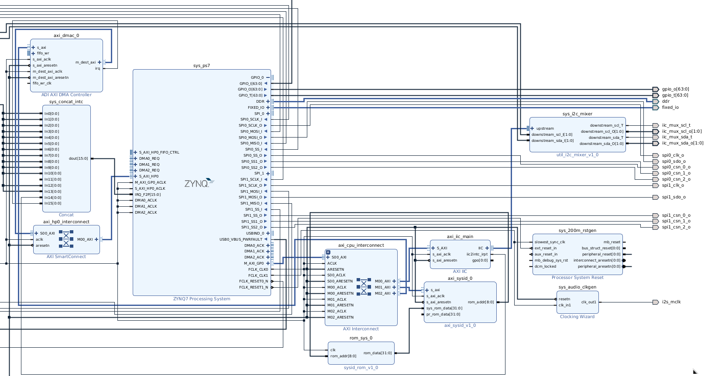
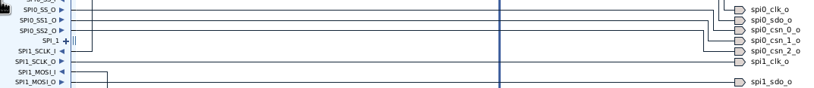
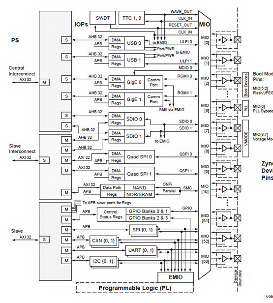

Here is all information and useful notes about Zynq-7000 (and similar) platforms and how I work with it. I write down stuff I found useful and would be glad if I have such reference when starting to work with that hardware.
I'm sure it would be useful for the people who only started to work with it. I put all important references so you can start right away.

## How to start?
Basically you need to run something on PL side of the chip and run a program on PS side. It could be Linux or baremetal code. I will describe the Linux way.

**PL side**  
For that you will need Vivado software. I would recommend to start with skeleton for the project from this [repo](https://github.com/analogdevicesinc/hdl). It's Analog Devices repo that contains a lot of design examples for all kind of Xilinx chips (Zynq-7000 included). Every example can be build from ground up using their TCL scripts which are easily reproducible. It gives you a good start up for future modifications.

Here is how simple design would look like (stripped example generated from hdl/projects/adv7511/zed):


Main components:
- sys_ps7 - main block to describe PS side, here you setup MIO/EMIO interfaces, clocks, setup communication buses to talk to PL side.
- axi_cpu_interconnect - the main interconnect from PS AXI master to all AXI slave peripherals on PL side.
- axi_hp0_interconnect - the interconnect for AXI master peripherals to talk to PS (mostly talking to system memory).
- sys_concat_intc - module to connect PL interrupts to system PS interrupts

**What is MIO/EMIO?**

You can take a look at some internal diagram of how chip works. Idea behind that is hardwired MUXER for all interfaces and their physical pins output. And you cannot change locations of that pins, as I said they are hardwired. But you also can change it to EMIO and you will receive output from sys_ps7 block and you can direct it to any FREE physical pins.

**Like these SPI interface**:  



**Internal structure**:


---
**NOTE**

Always try to script your project using TCL. Because it's pretty hard to transfer your Vivado project from one machine to another, it almost always complains about something. While using TCL it will build whole project from scratch using right dependencies. By that way you will get reproducible builds and that's pretty important!!! If you already have big block design, you still can export it as .bd file and then import using TCL. Here is the example of how to do that to include sources, constraints, block design and run the whole pipeline to get the final bitstream.  
[Example of TCL script](./tcl_example.tcl)

---

**PS side**  
Here you can use petalinux framework from Xilinx to build your custom Linux. I suggest you to install petalinux inside your virtual machine with certain Linux version on board, because it would be easy to meet all requirements for petalinux framework. [Here](https://github.com/analogdevicesinc/meta-adi/tree/main/meta-adi-xilinx) they describe the build process.

## How it works?
First of all you need to generate artifacts from your design using Vivado. For building Linux you will need 2 files: bitstream and hardware description.

Bitstream file is a binary file that describe how FPGA should be configured to implement your design. But .xsa (hardware description file) mostly needed for petalinux framework because it contains human readable description on how hardware configured. To be precise it contains all peripherals connections, their addresses, clocks and pins on PL side. Petalinux will use it to get more information about your hardware part.

**!!!**  
**Automatically generated device tree located in components/plnx_workspace/device-tree/device-tree/pl.dtsi. Here you will see the names of blocks as you name them in the design. And most of the time you want to delete these nodes in your device tree, because it's always wrong and you might want to change driver name or something, but it's a good reference to check what is the final address of your peripheral or which interrupt number you should use for it.**

Boot process: 
Boot rom -> First stage bootloader (FSBL) -> U-Boot -> Linux kernel.  

There are 3 important files to start booting simple version of your image:  
- BOOT.BIN - this contains FSBL, bitstream and U-Boot.
- boot.scr - script file for U-Boot about how to load Linux kernel.
- image.ub - Linux kernel with ramfs.

Follow [these instructions](https://github.com/analogdevicesinc/meta-adi/blob/main/meta-adi-xilinx/README.md) to create your first bootable sd-card.

## How to build communication between PL and PS?
This chip use AXI bus to connect PL and PS side. You always need it to build communication between your design peripherals and your code. There are 2 ways to use it:
- You can build AXI4 peripheral to implement some kind of registers you can read from and write to. I would suggest to take [that](https://github.com/alexforencich/verilog-axi/blob/master/rtl/axil_reg_if.v) implementation of AXI lite (subset of AXI4) peripheral and use reg_... interface to implement your own register-map. By doing that you will have a way to control something on your PL side.
- For data streaming you MUST use DMA. Most of the time you will use "AXI direct memory access" block from Xilinx. Here is the [documentation](https://docs.amd.com/r/en-US/pg021_axi_dma/Port-Descriptions) for it. The thing is that Xilinx implement their driver for that block in Linux kernel, [here](https://github.com/Xilinx/linux-xlnx/blob/master/drivers/dma/xilinx/xilinx_dma.c). But these driver implement some kind of API for DMA subsystem in Linux kernel and you can not use it directly from user space. That's why they write DMA proxy driver that will give tx_channel/rx_channel devices under /dev/ directory you can use and profit from DMA block, [here](https://github.com/Xilinx-Wiki-Projects/software-prototypes/tree/master/linux-user-space-dma).

## How to make better environment?
In simple case you just can always regenerate files for sd-card, put them on it and reboot your device. You will get tired pretty soon. So you have better options:
1. [Flash U-Boot via JTAG](https://docs.amd.com/r/en-US/ug1144-petalinux-tools-reference-guide/Booting-a-PetaLinux-Image-on-Hardware-with-JTAG):
```
petalinux-boot --jtag --fpga --bitstream bit.bit --u-boot --hw_server-url TCP:192.168.31.88:3121
```
You can run **hw_server** command directly in your terminal, it's always located in the same bin/ as Vivado, so it should be in your PATH.

It's a command you run inside your virtual machine. What it do? It will connect to your hardware server, and flash u-boot with bitstream directly into memory and then load it. **Hardware server** is a piece of software Vivado always launching when you debug your FPGA. It's a centralized way to control JTAG connection to your chip.

Next thing is U-Boot might find files on your sd-card and boot image.ub as it did previously. But it have options for **PXE boot**, which means it can fetch kernel and all needed stuff over the network and that's pretty COOL. [Here](https://docs.amd.com/r/en-US/ug1144-petalinux-tools-reference-guide/Booting-PetaLinux-Image-on-Hardware-with-TFTP). Setup TFTP server and you good to go.

2. [Flash Linux kernel via JTAG](https://docs.amd.com/r/en-US/ug1144-petalinux-tools-reference-guide/Booting-a-PetaLinux-Image-on-Hardware-with-JTAG):
It would take much longer as soon as JTAG need to write initramfs into memory. But still valuable approach.

## Better debugging
On PL side you can use ILA block to connect to different signals and access your probes through JTAG. It's always happened in block design, so in your verilog code use that for signal:
```
(* MARK_DEBUG = "TRUE" *) wire debug_wire,
```
After running synthesis you can create debug cores. You can change these cores without re-running synthesis part, only implementation.

---
When using debug cores you CAN'T use comparison for signed values, the system is unaware about 2's complement. Use these hack block to setup custom interrupt for you:
```
module compare_trigger(
    input signed [15:0] a, b,
    output gt, lt
    );
    
    assign gt = a > b;
    assign lt = a < b;
endmodule
```
The trick in **signed** keyword.
